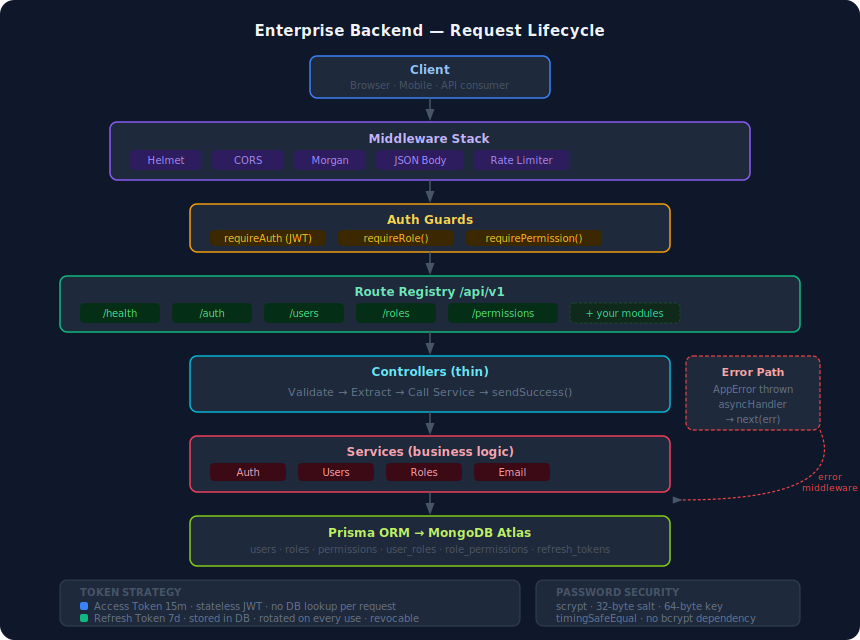
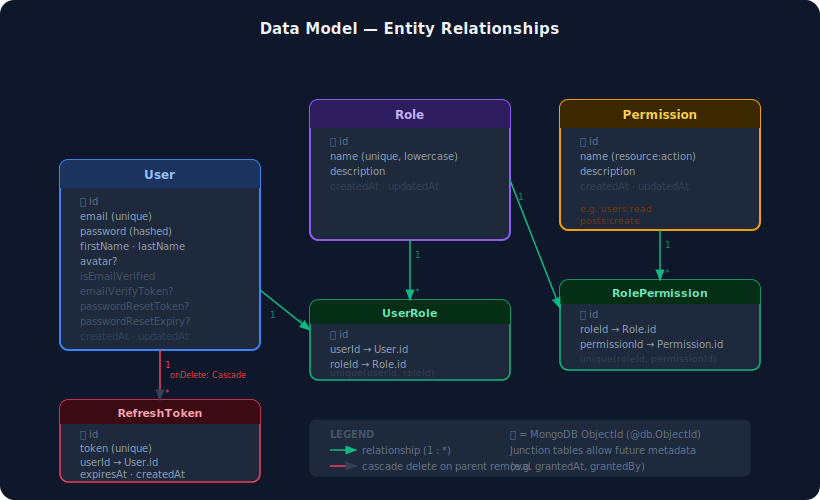

<div align="center">

# Enterprise Backend Boilerplate

**Production-ready REST API starter — Express · TypeScript · Prisma · MongoDB**

[](https://www.typescriptlang.org/)
[](https://expressjs.com/)
[](https://www.prisma.io/)
[](https://www.mongodb.com/)
[](https://www.docker.com/)
[](./LICENSE)
[]()

<br/>

*Stop rebuilding the same auth, RBAC, and user management for every project.*
*Clone, configure, ship.*

<br/>

[Quick Start](#-quick-start) · [Features](#-features) · [Architecture](#-architecture) · [API Docs](./docs/api.md) · [Folder Structure](./docs/folder-structure.md) · [Changelog](./CHANGELOG.md)

</div>

---

## 🖼️ Screenshots

<table>
<tr>
<td width="50%">

**Health Check Response**
```json
GET /api/v1/health

{
  "success": true,
  "message": "Health check",
  "data": {
    "status": "ok",
    "uptime": 3721,
    "database": "ok",
    "version": "1.0.0",
    "timestamp": "2026-06-26T10:00:00.000Z"
  }
}
```

</td>
<td width="50%">

**Standard Error Response**
```json
POST /api/v1/auth/register

{
  "success": false,
  "message": "Validation failed",
  "code": "VALIDATION_ERROR",
  "errors": {
    "email": "Email must be a valid email address",
    "password": "Password must contain uppercase, lowercase, number, and special character"
  }
}
```

</td>
</tr>
<tr>
<td width="50%">

**Paginated List Response**
```json
GET /api/v1/users?page=1&limit=10

{
  "success": true,
  "message": "Users retrieved",
  "data": [...],
  "meta": {
    "page": 1,
    "limit": 10,
    "total": 84,
    "totalPages": 9,
    "hasNextPage": true,
    "hasPrevPage": false
  }
}
```

</td>
<td width="50%">

**Login Success Response**
```json
POST /api/v1/auth/login

{
  "success": true,
  "message": "Login successful",
  "data": {
    "user": {
      "id": "...",
      "email": "user@example.com",
      "roles": ["admin"],
      "permissions": ["users:read", "users:create"]
    },
    "tokens": {
      "accessToken": "eyJhbGc...",
      "refreshToken": "a1b2c3d4..."
    }
  }
}
```

</td>
</tr>
</table>

---

## 🎬 Demo

> **Recording a demo?** Start the server with `npm run dev`, then walk through these steps in sequence — each one shows a key boilerplate capability:

| Step | Command | Shows |
|------|---------|-------|
| 1 | `GET /api/v1/health` | Server + DB status |
| 2 | `POST /api/v1/auth/register` | Account creation, validation errors |
| 3 | `POST /api/v1/auth/login` | Token pair returned |
| 4 | `GET /api/v1/auth/me` | JWT decoded, roles in payload |
| 5 | `GET /api/v1/users` (no token) | 401 Unauthorized |
| 6 | `GET /api/v1/users` (user token) | 403 Forbidden — wrong role |
| 7 | Login as admin → `GET /api/v1/users` | Paginated list |
| 8 | `POST /api/v1/roles` → `POST /api/v1/permissions` | RBAC setup |
| 9 | `POST /api/v1/auth/logout-all` | All sessions revoked |
| 10 | Old token → `GET /api/v1/auth/me` | 401 — token still technically valid but user has no sessions |

**Recommended tools for the demo recording:**
- [Bruno](https://www.usebruno.com/) or [Hoppscotch](https://hoppscotch.io/) for a visual API client
- [Loom](https://www.loom.com/) for screen recording

---

## ✨ Features

| Category | What's Included |
|---|---|
| 🔐 **Authentication** | Register · Login · JWT access + refresh tokens · Token rotation · Logout (single & all devices) |
| 📧 **Email Flows** | Password reset · Email verification · Welcome email · Nodemailer + HTML templates |
| 👥 **User Management** | Full CRUD · Pagination · Search · Filter · Sort · Profile management |
| 🛡️ **RBAC** | Roles · Permissions · `resource:action` naming · Many-to-many · Admin/user seeds |
| 🔒 **Security** | Helmet · CORS · Rate limiting · scrypt password hashing · Timing-safe comparison |
| 🏗️ **Architecture** | Feature-based modules · Clean separation · Standard response envelope · Typed errors |
| 📄 **Validation** | Fluent validation DSL · Per-field error messages · Strong password rules |
| 🐳 **DevOps** | Multi-stage Dockerfile · docker-compose · Health check endpoint · Graceful shutdown |
| 📚 **DX** | Full TypeScript strict mode · Seed script · .env.example · Professional docs |

---

## 🏛️ Architecture



> Full design rationale → [docs/architecture.md](./docs/architecture.md)

### Data Model



> Every field and relationship explained → [docs/architecture.md#data-model](./docs/architecture.md#data-model)

---

## 📁 Folder Structure

```
enterprise-backend-boilerplate/
│
├── prisma/
│   ├── schema.prisma          # Data models: User, Role, Permission, RefreshToken
│   └── seed.ts                # Seeds roles, permissions, admin user
│
├── src/
│   ├── app.ts                 # Express app factory (middleware + routes)
│   ├── server.ts              # Entry point: env check → DB connect → listen
│   │
│   ├── config/
│   │   └── env.ts             # Typed, validated environment config
│   │                          # Import `env` anywhere — never read process.env directly
│   │
│   ├── common/                # Zero-dependency shared utilities
│   │   ├── errors.ts          # AppError hierarchy — throw anywhere, caught globally
│   │   ├── logger.ts          # Structured logger with context + level
│   │   ├── async-handler.ts   # Wraps async route handlers (eliminates try/catch)
│   │   ├── response.ts        # sendSuccess / sendCreated / sendNoContent helpers
│   │   ├── pagination.ts      # parsePagination / parseSort / buildMeta
│   │   ├── crypto.ts          # hashPassword / verifyPassword / generateToken
│   │   └── validator.ts       # Fluent validation DSL — Validator class
│   │
│   ├── types/
│   │   └── express.d.ts       # Augments Express Request with req.user: AuthUser
│   │
│   ├── database/
│   │   └── client.ts          # Prisma singleton + connectDB / disconnectDB
│   │
│   ├── middleware/
│   │   ├── auth.middleware.ts       # requireAuth / optionalAuth — JWT verification
│   │   ├── authorize.middleware.ts  # requireRole / requirePermission — RBAC guards
│   │   ├── error.middleware.ts      # Global error handler — last middleware in app.ts
│   │   ├── not-found.middleware.ts  # 404 handler
│   │   └── rate-limiter.middleware.ts # In-memory sliding-window rate limiter
│   │
│   ├── services/
│   │   └── email.service.ts   # Generic transactional email (reset, verify, welcome)
│   │
│   ├── routes/
│   │   └── index.ts           # Central registry — mounts all module routers
│   │
│   └── modules/               # Feature-based modules (add yours here)
│       ├── health/
│       │   ├── health.controller.ts
│       │   └── health.routes.ts
│       ├── auth/
│       │   ├── auth.service.ts    # Register, login, token ops, password flows
│       │   ├── auth.controller.ts
│       │   ├── auth.validator.ts
│       │   └── auth.routes.ts
│       ├── users/
│       │   ├── users.service.ts   # CRUD, search, pagination, role assignment
│       │   ├── users.controller.ts
│       │   ├── users.validator.ts
│       │   └── users.routes.ts
│       ├── roles/
│       │   ├── roles.service.ts   # Role CRUD, permission assignment
│       │   ├── roles.controller.ts
│       │   └── roles.routes.ts
│       └── permissions/
│           ├── permissions.service.ts
│           ├── permissions.controller.ts
│           └── permissions.routes.ts
│
├── api/
│   └── index.ts               # Vercel serverless entry point
│
├── docs/
│   ├── api.md                 # Complete API reference with examples
│   ├── architecture.md        # Deep-dive architecture documentation
│   └── folder-structure.md    # This folder explained in detail
│
├── .env.example               # Template — copy to .env to get started
├── .gitignore
├── .dockerignore
├── Dockerfile                 # Multi-stage production build
├── docker-compose.yml
├── nodemon.json
├── package.json
├── tsconfig.json
├── vercel.json
├── CHANGELOG.md
├── LICENSE
└── README.md
```

> See [docs/folder-structure.md](./docs/folder-structure.md) for an annotated explanation of every file and design decision.

---

## 🚀 Quick Start

### Prerequisites
- **Node.js 20+**
- A **MongoDB Atlas** cluster ([free tier](https://www.mongodb.com/cloud/atlas/register))

### 1 — Install

```bash
git clone https://github.com/your-username/enterprise-backend-boilerplate.git
cd enterprise-backend-boilerplate
npm install
```

### 2 — Configure

```bash
cp .env.example .env
```

Open `.env` and set the three required values:

```env
DATABASE_URL="mongodb+srv://<user>:<pass>@cluster0.xxxxx.mongodb.net/myapp"
JWT_ACCESS_SECRET=<run: node -e "console.log(require('crypto').randomBytes(64).toString('hex'))">
JWT_REFRESH_SECRET=<run again for a different value>
```

### 3 — Seed

```bash
npm run prisma:generate   # generates the Prisma client
npm run prisma:seed       # creates roles, permissions, admin user
```

Default admin credentials (change after first login):
```
Email:    admin@example.com
Password: Admin@1234
```

### 4 — Run

```bash
npm run dev
```

```
[INFO] [database] MongoDB connected via Prisma
[INFO] [server]   Server running on http://localhost:3000 [development]
[INFO] [server]   API base: http://localhost:3000/api/v1
```

Test the health endpoint:
```bash
curl http://localhost:3000/api/v1/health
```

---

## 📡 API Overview

All endpoints are under `/api/v1`. Full reference → [docs/api.md](./docs/api.md).

### Auth  `/api/v1/auth`

| Method | Endpoint | Auth | Description |
|--------|----------|:----:|-------------|
| `POST` | `/register` | — | Create account + send verification email |
| `POST` | `/login` | — | Get access + refresh tokens |
| `POST` | `/refresh-token` | — | Rotate token pair |
| `POST` | `/forgot-password` | — | Send password-reset email |
| `POST` | `/reset-password` | — | Set new password via reset token |
| `GET`  | `/verify-email?token=` | — | Verify email address |
| `GET`  | `/me` | 🔒 Bearer | Current user profile with roles & permissions |
| `POST` | `/logout` | 🔒 Bearer | Revoke refresh token |
| `POST` | `/logout-all` | 🔒 Bearer | Revoke all sessions |
| `POST` | `/change-password` | 🔒 Bearer | Change own password |
| `POST` | `/resend-verification` | 🔒 Bearer | Re-send verification email |

### Users  `/api/v1/users`

| Method | Endpoint | Auth | Description |
|--------|----------|:----:|-------------|
| `GET`  | `/profile` | 🔒 Bearer | Own profile |
| `PATCH`| `/profile` | 🔒 Bearer | Update own profile |
| `GET`  | `/` | 🔒 admin | List users — `?page&limit&search&isActive&sortBy&sortOrder` |
| `POST` | `/` | 🔒 admin | Create user |
| `GET`  | `/:id` | 🔒 admin | Get user by ID |
| `PATCH`| `/:id` | 🔒 admin | Update user |
| `DELETE`| `/:id` | 🔒 admin | Delete user (cascades) |
| `POST` | `/:id/roles` | 🔒 admin | Assign role to user |
| `DELETE`| `/:id/roles/:roleId` | 🔒 admin | Remove role from user |

### Roles  `/api/v1/roles`

| Method | Endpoint | Auth | Description |
|--------|----------|:----:|-------------|
| `GET`  | `/` | 🔒 admin | List roles with permissions |
| `POST` | `/` | 🔒 admin | Create role |
| `GET`  | `/:id` | 🔒 admin | Get role |
| `PATCH`| `/:id` | 🔒 admin | Update role |
| `DELETE`| `/:id` | 🔒 admin | Delete role |
| `POST` | `/:id/permissions` | 🔒 admin | Assign permission to role |
| `DELETE`| `/:id/permissions/:permissionId` | 🔒 admin | Remove permission from role |

### Permissions  `/api/v1/permissions`

| Method | Endpoint | Auth | Description |
|--------|----------|:----:|-------------|
| `GET`  | `/` | 🔒 admin | List all permissions |
| `POST` | `/` | 🔒 admin | Create permission (`resource:action`) |
| `GET`  | `/:id` | 🔒 admin | Get permission |
| `PATCH`| `/:id` | 🔒 admin | Update permission |
| `DELETE`| `/:id` | 🔒 admin | Delete permission |

### Health  `/api/v1/health`

| Method | Endpoint | Auth | Description |
|--------|----------|:----:|-------------|
| `GET`  | `/` | — | DB status · uptime · version |

---

## 🔐 Security Model

### Password Hashing

Uses **Node.js `crypto.scrypt`** — RFC 7914 memory-hard key derivation. More resistant to GPU attacks than bcrypt. No external dependency.

```
stored format:  <hex-salt-32-bytes>:<hex-derived-key-64-bytes>
comparison:     timingSafeEqual() — immune to timing attacks
```

### JWT Strategy

| Token | Expiry | Storage | Purpose |
|---|---|---|---|
| Access Token | 15 min | Client memory | API calls |
| Refresh Token | 7 days | Database | Issue new access tokens |

Refresh tokens are **rotated** on every use — the old token is deleted and a new one is issued. Compromised refresh tokens are automatically invalidated on next rotation.

### Rate Limiting

| Scope | Limit | Window |
|---|---|---|
| Global | 100 req / IP | 15 min |
| Auth endpoints | 10 req / IP | 15 min |

> For distributed deployments (multiple instances), replace the in-memory rate limiter with Redis-backed `express-rate-limit`. See [docs/architecture.md](./docs/architecture.md#scaling).

---

## ➕ Adding a New Module

Every feature gets its own folder under `src/modules/`:

```bash
mkdir src/modules/posts
```

Create these 4 files:

```
src/modules/posts/
├── posts.service.ts    # Business logic + Prisma queries
├── posts.controller.ts # HTTP layer (validate → call service → respond)
├── posts.validator.ts  # Input validation using Validator class
└── posts.routes.ts     # Express Router
```

Register in `src/routes/index.ts`:
```typescript
import postsRoutes from '../modules/posts/posts.routes';
router.use('/posts', postsRoutes);
```

Add your Prisma model to `prisma/schema.prisma`, then run:
```bash
npm run prisma:generate
```

That's it. See [docs/architecture.md](./docs/architecture.md#adding-a-module) for the full guide.

---

## 🐳 Docker

```bash
# Development (with live reload)
npm run dev

# Production container
docker-compose up --build

# Just the Docker image
docker build -t my-api .
docker run -p 3000:3000 --env-file .env my-api
```

The Dockerfile uses a multi-stage build:
- **Stage 1 (builder):** installs all deps, compiles TypeScript
- **Stage 2 (runner):** production deps only, copies compiled JS — final image ~150MB

---

## ☁️ Deploy to Vercel

```bash
npm install -g vercel
vercel deploy
```

`api/index.ts` and `vercel.json` are pre-configured for Vercel's Node.js serverless runtime. Set all `.env` variables in the Vercel dashboard before deploying to production.

---

## 🔧 Environment Variables

| Variable | Required | Default | Description |
|---|:---:|---|---|
| `DATABASE_URL` | ✅ | — | MongoDB connection string |
| `JWT_ACCESS_SECRET` | ✅ | — | Secret for signing access tokens (64+ chars) |
| `JWT_REFRESH_SECRET` | ✅ | — | Secret for signing refresh tokens (64+ chars) |
| `PORT` | — | `3000` | HTTP port |
| `NODE_ENV` | — | `development` | `development` or `production` |
| `FRONTEND_URL` | — | `http://localhost:3000` | Allowed CORS origin |
| `JWT_ACCESS_EXPIRES_IN` | — | `15m` | Access token lifetime |
| `JWT_REFRESH_EXPIRES_IN` | — | `7d` | Refresh token lifetime |
| `SMTP_HOST` | — | — | SMTP server (email disabled if unset) |
| `SMTP_PORT` | — | `587` | SMTP port |
| `SMTP_USER` | — | — | SMTP username |
| `SMTP_PASS` | — | — | SMTP password / app password |
| `SMTP_FROM` | — | `noreply@example.com` | Sender address |
| `RATE_LIMIT_WINDOW_MS` | — | `900000` | Rate limit window (ms) |
| `RATE_LIMIT_MAX` | — | `100` | Max requests per window per IP |
| `ADMIN_EMAIL` | — | `admin@example.com` | Seed script only |
| `ADMIN_PASSWORD` | — | `Admin@1234` | Seed script only |

---

## 📦 Scripts

| Script | Description |
|---|---|
| `npm run dev` | Start development server with hot-reload |
| `npm run build` | Compile TypeScript to `dist/` |
| `npm start` | Run compiled production server |
| `npm run lint` | TypeScript type-check (no emit) |
| `npm run prisma:generate` | Regenerate Prisma client after schema changes |
| `npm run prisma:studio` | Open Prisma Studio (visual DB browser) |
| `npm run prisma:seed` | Seed default roles, permissions, and admin user |

---

## 📚 Documentation

| Document | Description |
|---|---|
| [docs/api.md](./docs/api.md) | Complete API reference with request/response examples |
| [docs/architecture.md](./docs/architecture.md) | System design, data model, scaling guide |
| [docs/folder-structure.md](./docs/folder-structure.md) | Every file explained with design rationale |
| [CHANGELOG.md](./CHANGELOG.md) | Version history and migration notes |

---

## 🗺️ Roadmap

- [ ] OpenAPI 3.0 / Swagger UI (`/api/v1/docs`)
- [ ] Redis-backed rate limiter for distributed deployments
- [ ] File upload service (S3 / local)
- [ ] WebSocket support
- [ ] Multi-tenancy (organisation model)
- [ ] Audit log module
- [ ] Two-factor authentication (TOTP)
- [ ] PostgreSQL variant

---

## 📄 License

[MIT](./LICENSE) © 2026

---

<div align="center">

Built with ❤️ for developers who ship fast without cutting corners.

**[⭐ Star this repo](https://github.com/your-username/enterprise-backend-boilerplate)** if it saved you hours.

</div>
